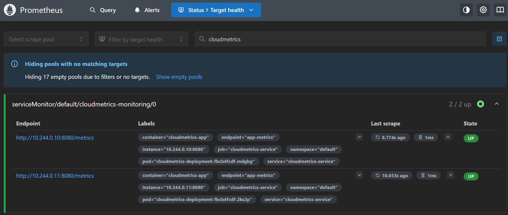
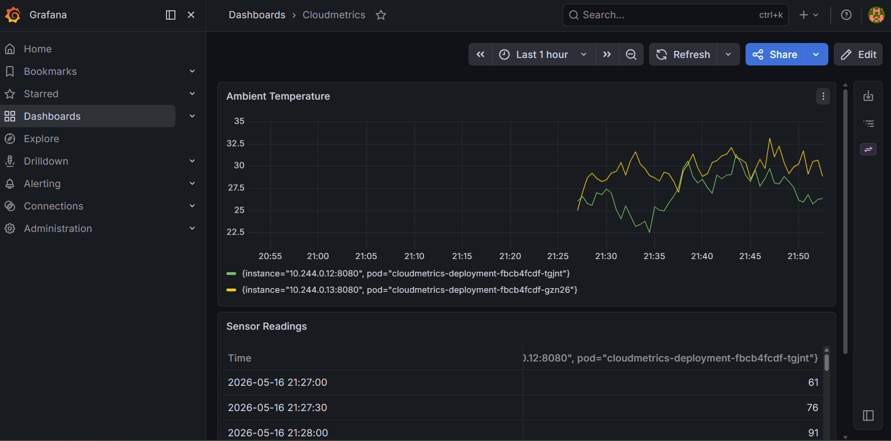

# Cloudmetrics

A Go-based sensor simulator designed to run in Docker and Kubernetes. It
provides real-time simulated ambient temperature data and reading counts via a 
Prometheus-compatible `/metrics` endpoint.

## Prerequisites

Before deploying the CloudMetrics app, ensure you have the following:

- A running [Kubernetes](https://kubernetes.io/) cluster (by e.g. using [Docker Desktop](https://www.docker.com/products/docker-desktop/))
- [Helm](https://helm.sh/) (package manager for Kubernetes) installed

The application uses a `ServiceMonitor` to export metrics. This requires the
Prometheus Operator to be installed in your cluster:

```bash
# Add the prometheus-community helm repo
helm repo add prometheus-community https://prometheus-community.github.io/helm-charts
helm repo update

# Install the kube-prometheus-stack inside the 'monitoring' namespace
# This installs Prometheus, Grafana, and the required Custom Resource Definitions (CRDs)
helm install prometheus prometheus-community/kube-prometheus-stack \
  --create-namespace \
  --namespace monitoring
```

## Local Build

Build the optimized container using the multi-stage Dockerfile, which also
automatically runs unit tests:

```bash
docker build -t cloudmetrics:latest .
```

## Kubernetes Deployment

To deploy the application to your local Kubernetes cluster, simply run:

```bash
kubectl apply -f k8s/
```

## Accessing Data

1. **Application Metrics**: Once the `EXTERNAL-IP` of the `cloudmetrics-service`
appears, visit http://localhost:8080/metrics to see the raw Prometheus format.
2. **Prometheus UI**: To verify Prometheus is successfully scraping the pods,
first port-forward the service:

    ```bash
    kubectl port-forward svc/prometheus-kube-prometheus-prometheus -n monitoring 9090
    ```

    Open http://localhost:9090/, navigate to `Status > Target health` and
    ensure the `cloudmetrics-monitoring` target is `UP` (might take some time to
    appear).

    

    You can also inspect the logs to see the endpoint being scraped:

    ```bash
    $ kubectl logs -l app=cloudmetrics                    
    2026/05/16 02:15:27 Request: GET /metrics from <pod-ip>:48862
    2026/05/16 02:15:43 Request: GET /metrics from <pod-ip>:48862
    2026/05/16 02:15:58 Request: GET /metrics from <pod-ip>:48862
    2026/05/16 02:16:14 Request: GET /metrics from <pod-ip>:48862
    2026/05/16 02:16:29 Request: GET /metrics from <pod-ip>:48862
    2026/05/16 02:16:45 Request: GET /metrics from <pod-ip>:48862
    2026/05/16 02:17:00 Request: GET /metrics from <pod-ip>:48862
    2026/05/16 02:17:16 Request: GET /metrics from <pod-ip>:48862
    2026/05/16 02:17:31 Request: GET /metrics from <pod-ip>:48862
    2026/05/16 02:17:47 Request: GET /metrics from <pod-ip>:48862
    2026/05/16 02:15:30 Request: GET /metrics from <pod-ip>:42504
    2026/05/16 02:15:45 Request: GET /metrics from <pod-ip>:42504
    2026/05/16 02:16:01 Request: GET /metrics from <pod-ip>:42504
    2026/05/16 02:16:16 Request: GET /metrics from <pod-ip>:42504
    2026/05/16 02:16:32 Request: GET /metrics from <pod-ip>:42504
    2026/05/16 02:16:47 Request: GET /metrics from <pod-ip>:42504
    2026/05/16 02:17:03 Request: GET /metrics from <pod-ip>:42504
    2026/05/16 02:17:18 Request: GET /metrics from <pod-ip>:42504
    2026/05/16 02:17:34 Request: GET /metrics from <pod-ip>:42504
    2026/05/16 02:17:49 Request: GET /metrics from <pod-ip>:42504
    ```

3. **Grafana UI**: To access the Grafana UI, 
first port-forward it:

    ```bash
    kubectl port-forward svc/prometheus-grafana -n monitoring 3000:80
    ```

    Next, retrieve the password (`base64` encoded) using the following command:

    ```bash
    kubectl get secret --namespace monitoring prometheus-grafana -o jsonpath="{.data.admin-password}" | base64 --decode ; echo
    ```

    Open http://localhost:3000/ and log in using the username `admin` and
    password decoded above. You should be able to open the `Cloudmetrics`
    dashboard to see the metrics being displayed.

    

## Development & Testing

If you add new Go packages, update the `go.mod` and `go.sum` files using a
container:

```bash
docker run --rm -v ./app:/app -w /app golang:1.23-alpine sh -c "go mod init cloudmetrics-app ; go mod tidy"
```

## Cleanup

To stop and remove all Kubernetes resources:

```bash
kubectl delete -f k8s/
```

For details on how to uninstall the `kube-prometheus-stack` chart, refer to the
[official documentation](https://github.com/prometheus-community/helm-charts/tree/556bfa39ea386b9d261b5ca49a9dc62f112ec78f/charts/kube-prometheus-stack#uninstall-helm-chart).
