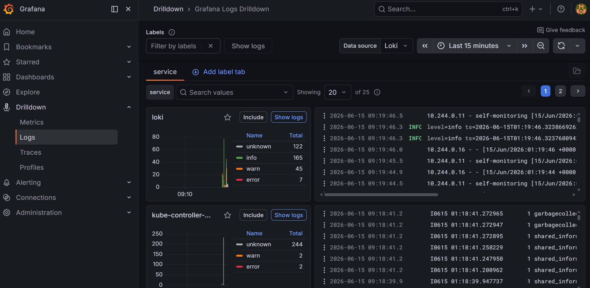

# Cloudmetrics

A Go-based sensor simulator for Kubernetes, featuring a complete observability
stack. It generates real-time temperature telemetry and reading counts, exported
via Prometheus metrics and Loki-compatible logs.

## Prerequisites

- A running [Kubernetes](https://kubernetes.io/) cluster
- [Helm](https://helm.sh/) (package manager for Kubernetes) installed
- [Helmfile](https://github.com/helmfile/helmfile) and the [Helm Diff](https://github.com/databus23/helm-diff)
plugin:

  ```bash
  helm plugin install https://github.com/databus23/helm-diff
  ```

## Deployment

### The Observability Stack

First, ensure that `kubectl` is pointed at your cluster. Next, create the
admin secret to log into the Grafana UI:

```bash
kubectl create namespace monitoring
kubectl create secret generic grafana-admin-secret \
  -n monitoring \
  --from-literal=admin-user=admin \
  --from-literal=admin-password='supersecurepassword'
```

Deploy the entire observability stack:

```bash
helmfile -f deploy/observability/helmfile.yaml apply
```

### The Cloudmetrics App

Build the optimized container using the multi-stage Dockerfile, which also
automatically runs unit tests:

```bash
docker build -t cloudmetrics:latest .
```

To deploy the application to your local Kubernetes cluster, use Helm:

```bash
helm install cloudmetrics-dev charts/cloudmetrics
```

## Accessing Data

1. **Application Metrics**: Once the `EXTERNAL-IP` of the `cloudmetrics-service`
appears, visit http://localhost:8080/metrics to see the raw Prometheus format.

2. **Grafana UI**: To access the Grafana UI, first port-forward it:

    ```bash
    kubectl port-forward svc/prometheus-grafana -n monitoring 3000:80
    ```

    **Metrics**: Open http://localhost:3000/ and log in using the username and
    password you stored in the Kubernetes secret above. You should be able to
    open the `Cloudmetrics` dashboard to see the metrics being displayed.

    

    **Logs**: Go to `Explore`, select the `Loki` data source, and run: `{service_name="cloudmetrics-app"}`.

    

## Development & Testing

If you add new Go packages, update the `go.mod` and `go.sum` files using a
container:

```bash
docker run --rm -v ./app:/app -w /app golang:1.23-alpine sh -c "go mod init cloudmetrics-app ; go mod tidy"
```

## Cleanup

To stop and remove the application and its associated resources:

```bash
helm uninstall cloudmetrics-dev
```

To remote the observability stack:

```bash
helmfile -f deploy/observability/helmfile.yaml destroy
kubectl delete ns monitoring
```
